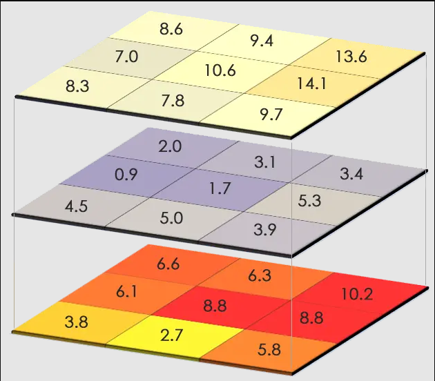

```{r packages, echo = F, eval = T, message = F}
library(maps)
library(raster)
library(sf)
library(tidyverse)
```

# Spatial Data in R

## Vectors 

The primary packages that deal with these features are [`sf`](https://cran.r-project.org/web/packages/sf/index.html) and [`sp`](https://cran.r-project.org/web/packages/sp/index.html)

**sf** means "simple feature" while **sp** is short for "spatial."  [This website](https://cengel.github.io/R-spatial/intro.html#conceptualizing-spatial-vector-objects-in-r) goes into more detail about these packages and the specifics about objects from these packages. 

Please note, however, that `sp` is being deprecated soon and R users are encouraged to solely use `sf`. So while `sp` functions still work for now, we're going to consider it deprecated and just go over `sf` in this workshop.

### Loading vector data from a spreadsheet

You will often have a spreadsheet of data that have two columns of latitude and longitude (and potentially other columns for the attributes of these features). 

```{r loadCSV, echo = T, eval = T}
sites <- read.csv("Data/Examples/Sites.csv")
head(sites)
class(sites)
```

How can we convert this data table into a spatial object? 

We'll use the function `st_as_sf()` to convert an object of another class to an `sf` object. As with any function, you can always type `?st_as_sf` in the console to remind yourself what the function does and what arguments you need to add. In this case, the non-optional arguments are `x` (the object we want to convert, in this case our sites data frame) and `coords` (the columns in the data frame that have the coordinate data). 

The argument `crs` is optional but we should add it so that our spatial object has a coordinate reference system. Because our coordinates are lat/long, we should tell `st_as_sf` that our crs is WGS84 lat/long (Remember that the EPSG code for WGS84 lat/long is [4326](https://www.spatialreference.org/ref/epsg/4326/)). **Note: Even if you're working in a different geographic or projection coordinate system, it is ALWAYS good practice to load in lat/long coordinates as WGS84 lat/long and then later projecting the object, instead of right away giving it a projected coordinate system.** This is because GPS coordinates work with a global datum (being a **global** positioning system), and you might have inaccurate positions if you load it in with another datum or projection.

```{r stAsSf, eval = T, echo = T}
sites_sf <- st_as_sf(sites, 
                     coords = c("Longitude", "Latitude"), 
                     crs = 4326)
head(sites_sf)
```

Now when we look at the `head` of `sites_sf` it also prints out some information about this spatial object: it is a simple feature, it is a `POINT` object, the min/max coordinates (the bounding box), and the CRS. Note that the "Longitude" and "Latitude" columns turned into a "geometry" column. We can also check this information with separate functions: `st_bbox` and `st_crs`

```{r checkSFinfo, eval = T, echo = T}
st_bbox(sites_sf)

st_crs(sites_sf)
```

`st_crs` printed out a lot of information, but the important things to note are that we (the user) inputted EPSG: 4326, its datum is "World Geodetic System 1984" (or WGS 84), its axes are latitude and longitude, and its units are "degree" (as opposed to a linear unit like m that we might see in a projected crs). It's always good practice to double check the CRS of your object before you perform any analysis. 

Note that now when we look at the `class` of `sites_sf` it has **two** classes: `sf` and `data.frame`.

```{r classSF, eval = T, eval = T}
class(sites_sf)
```

This is one of the great things about `sf`: because `sf` objects remain as class `data.frame`, it makes it easy to work with an `sf` object like you would with any data frame.

Now that it's a spatial object, let's plot it and see what it looks like!

```{r plotBase, eval = T, echo = T}
plot(sites_sf, pch = 16)
```

This object only has one attribute ("Site"). If it had more than one, plotting in base R (i.e. using the `plot` function) plots all attributes (it will actually only plot 10 and will give you a warning if there are more than 10 attributes).

To just plot the feature's shape, we can use `st_geometry` to extract the geometry of the vector

```{r plotBase2, eval = T, echo = T}
plot(st_geometry(sites_sf), pch = 16)
```

We can also use `ggplot2` to plot `sf` objects. `ggplot2` has a function called `geom_sf`, which makes it easy to visualize `sf` objects with `ggplot2`

```{r sfGGplot, eval = T, echo = T}
ggplot(sites_sf) +
  geom_sf() # note that we don't need to tell ggplot what it should consider x and y to be; that's already built in with the "geometry" column!
```

Remember, though, that this workshop will not cover how to make nice maps in R (that will be in the next workshop). I just bring this up because you would want to be sure the data you're working with looks like what you might expect it to, so you would want to make a quick plot before moving on to analysis.

### Loading vector data from a shapefile

A lot of the time, you will have spatial data already saved as a shapefile. How do we load that into R?

We'll use the function `st_read` which takes two arguments: `dsn` (data source name), which is essentially the folder where the shapefile is located, and `layer`, which is the name of file (without any extensions). `layer` is technically optional because `dsn` will choose the first file in that folder, so if the shapefile is the only file in that folder, then `dsn` will automatically choose the file. But I like to specify the layer name to avoid any mishaps.

```{r stRead, echo = T, eval = T}
# Shapefile: freeways in Utah
fwy_sf <- st_read(dsn = "Data/Examples/utah_freeway", layer = "utah_freeway")
```
You'll note that as we read in a shapefile with `st_read`, it automatically prints out the information about this feature (if you don't want R to print this, put `quiet = FALSE` in the function).

Again, we can check this information separately (in case we forget or we need to check later in the analysis). We can also check the first few rows of the data frame to see what kind of attributes there are, and we can plot the feature to make sure it looks like what we expect it to be.

```{r checkSF2, echo = T, eval = T}
st_bbox(fwy_sf)
st_crs(fwy_sf)
head(fwy_sf)
ggplot(fwy_sf) +
  geom_sf()
```


### Projecting vector data

So far all of our vector data has only been in WGS 84 lat/long CRS. More than likely you will want to work in a projected coordinate system. So how do we re-project (or transform) features in R?

We will use the `sf` function `st_transform()`

This function needs the object you want to re-project and the target CRS. 

What CRS should we work in? As was stated in the "GIS basics" chapter, UTM is a popular projection because it's localized and allows you to work with with linear metrics like length, area, and distance. Since both of these features (our site data and Utah freeways) are located in Utah, we would use UTM 12N. We can stay in the WGS 84 datum, but for the purposes of demonstration, let's change to NAD83. (Remember from the previous chapter that there is not much difference between these datums, so it's up to you if you want to use a more localized datum (NAD83) or a more recent datum (WGS84)). The EPSG code for NAD83 UTM 12N is [26912](https://www.spatialreference.org/ref/epsg/26912/). (If you want to work in WGS84 UTM 12N, the EPSG code is [32612](https://www.spatialreference.org/ref/epsg/32612/))

```{r transform, echo = T, eval = T, warning = F}
fwy_sf_proj <- st_transform(fwy_sf, crs = 26912)
st_crs(fwy_sf_proj)
```

Note that the coordinates of the WGS84 object compared the coordinates of the projected object are different.

```{r checkCoords, echo = T, eval = T}
st_geometry(fwy_sf)
st_geometry(fwy_sf_proj)
```

The coordinates for the object in WGS84 are in lat/long and the units are decimal degrees. The coordiantes for the projected object are in UTM and the untis are meters. 

**REMINDER:** You should **always** double-check the CRS of every feature and object you're working with because you want to make sure everything is projected to the **same** CRS! If they're not, it could result in inaccurate analysis and plotting. Depending on what functions you're using, R may give you a warning or error that the CRS of one feature and another don't match, but it's best not to rely on this and just double-check yourself.

### Saving vector data

Once you've created or modified a spatial object, most likely you want to save it so you can use it later or share with collaborators. There are many files types that can hold spatial data, but the most commonly used are ESRI Shapefile (which can be used in ArcGIS software), KML (which can be used with Google Earth Engine), GeoJSON, and PostgreSQL. If you're curious what other file types are out there, you can use function `st_drivers()` for `sf` objects. In this workshop, I will focus just on ESRI Shapefiles.

If you've worked with shapefiles before, you've likely noticed that a shapefile is actually a collection of files with the extensions .dbf, .prj, .shp, and .shx. It's often easier to organize and share shapefiles if they're in their own folder. If you don't already have a folder ready for any shapefiles that you're ready to save, you can, of course, manually make one in the File Explorer. But you can also create folders in R! I, personally, often like to do this because it helps streamline my process. To do so we'll use the functions `dir.exists()` to check if the directory (or folder) exists or not, and if it doesn't we'll use `dir.create()` to create a directory.

```{r saveData, echo = T, eval = F}
out_dir <- "Data/Examples/Sites_shp" # name what you want the folder to be and save it in an object

if(!dir.exists(out_dir)){ # this if statement is basically saying "if out_dir does NOT exist..." (the NOT is from the exclamation mark)
  dir.create(out_dir) # and if out_dir does NOT exist, then dir.create will create it
}
```

Now that we've created a new directory for this shapefile to go to, let's save our shapefile! For `sf` objects we'll use the function `st_write`. This function takes the object you're saving, the dsn (or the folder) you want to save it to, the layer (or the name you want to save the file as, do NOT add an extension), and the driver (meaning if you're saving it as an ESRI Shapefile, KML, etc.)

```{r save, eval = F, echo = T}
st_write(sites_sf, dsn = out_dir, layer = "Sites_sf", driver = "ESRI Shapefile")
```

### A note about `sf` and `tidyverse` {-}

As mentioned earlier, `sf` works really well with `tidyverse`. If you are familiar with `tidyverse` then you know that one pro of this package is the pipe (`%>%`) which lets you perform multiple functions at once without getting cluttered and hard to read. Functions for `sf` can easily be incorporated into the `tidyverse` piping method as well. For an example, we can load a csv file, convert it to an `sf` object, project it, and save it all at once using the pipes.

```{r piping, eval = F, echo = T}
read.csv("Data/Examples/Sites.csv") %>%
  st_as_sf(coords = c("Longitude", "Latitude"), crs = 4326) %>%
  st_transform(crs = 26912) %>%
  st_write(dsn = "data", layer = "Sites_shp", driver = "ESRI Shapefile")
```

Of course, this requires that you already know what the column names for the coordinates are, and this might not be the best example for a series of functions to use with the pipe. But this type of process is a useful tool to know, especially if you are already familiar with and frequently use `tidyverse`.

### Your Turn! {-}

In the attached "worksheet", there are some exerices to help you practice these concepts and functions. Try them out!

---------------------------------------------------------------------------------

## Rasters 

The primary package that deals with rasters is [`raster`](https://cran.r-project.org/web/packages/raster/index.html). ([`terra`](https://cran.r-project.org/web/packages/terra/index.html) also works with rasters but is funcitonally very similar to `raster`).

### Load a raster

When you want to load a raster that is saved in a directory, you'll use the (aptly named) function `raster`. When loading a raster that is already saved, the only argument you need is the filename (including the directory and extension)

```{r loadRaster, eval = T, echo = T}
elev <- raster("Data/Examples/elevation.tif")
elev
```
When we examine the raster (by simply calling the object like we did above), we get a lot of useful information.

* `class`: the class of the raster (this could be `RasterLayer`, `RasterStack`, or `RasterBrick`)
* `dimensions`: the number of rows, columns, and cells
* `resolution`: the size of the cells
* `extent`: the min/max x and y 
* `crs`: the coordinate reference system
* `values`: the min/max values this raster contains

I recommend *always* examining a raster after you load it in to make sure the information looks like what you would expect it to be.

You can also check all of this information with separate functions:

```{r checkRastInfo, eval = T, echo = T}
class(elev)
nrow(elev)
ncol(elev)
ncell(elev)
res(elev) # the cell resolution of the raster
extent(elev)
proj4string(elev) # alternatively, we can use crs(r) which will print out a lot more information. proj4string() is sufficient
summary(values(elev)) # put this in summary() so we can get an idea of the spread of values (rather than a list of all of the values themselves)
```

We can also plot the raster to check that it looks like what we would expect it to be

```{r plotRast, eval = T, echo = T}
plot(elev)
```

We can also plot a raster with `ggplot2`, but we need to do an extra step of converting it to a data frame first. We'll use the base R function `as.data.frame` and we need to be sure to put `xy = TRUE` in the arguments. After we do that, we can use the function `geom_raster()` within `ggplot`. Within the `aes()` function in `geom_raster()`, we need to put the columns that correspond to the x and y locations and what the fill value should represent (in this case, elevation).

```{r plotRastGGplot, eval = T, echo = T}
elev_df <- as.data.frame(elev, xy = TRUE)
head(elev_df) # the data frame of a raster contains columns for the x and y locations and the corresponding cell value
ggplot(elev_df) +
  geom_raster(aes(x = x, y = y, fill = elevation))
```
```{r plotRastGGplotPipe, eval = F, echo = T}
# You can use the pipe to run this process all at once
elev %>%
  as.data.frame(xy = TRUE) %>%
  ggplot() +
  geom_raster(aes(x = x, y = y, fill = elevation)) # This requires that you know the column name of the raster values
```

An important thing to note is that, depending on the size of the raster, it might be too computationally expensive to convert a raster to a data frame and R may give you an error.

(Another reminder that we will not cover how to make these maps look nice, this is just a quick way to check that your raster looks the way that you think it should)

#### Loading a raster with more than one band {-}

In the example above, the raster we loaded only had one band. Let's try loading in a raster downloaded from [SNODAS](https://nsidc.org/data/g02158) (Snow Data Assimilation System) which has 2 bands: SWE (snow water equivalent) and snow depth. (SNODAS offers daily rasters, and this example raster is from 02-23-2019).

```{r snow, eval = T, echo = T}
snow <- raster("Data/Examples/snow_20190223.tif")
snow
```

Notice how it says band 1 (of 2). If there are two bands, why did it only load 1? If we look in the help file for `?raster`, it says that this function creates a `RasterLayer` object, meaning only **1** band. We can also see that there's an argument called `band`, meaning you can specify which band you want to load (and the default is the first band). We *could* load individual bands one-by-one, but that's tedious and, depending how many bands a raster stack has, could be lines and lines of repetitive code. 

Instead, we'll use the function `stack()` or `brick()`

```{r snowStk, eval = T, echo = T}
snow_stack <- stack("Data/Examples/snow_20190223.tif")
class(snow_stack)
snow_stack

snow_brick <- brick("Data/Examples/snow_20190223.tif")
class(snow_brick)
snow_brick
```

Notice that after `dimensions` it has 4 elements, instead of 3 like the `RasterLayer` had. The 4th element represents the number of bands (or layers) this stack is composed of. We can check this independently with the functions `dim()` and `nlayers()`

```{r checkNBands, eval = T, echo = T}
dim(snow_stack)
nlayers(snow_stack)
```

When we call the stack and the brick, they look identical besides the class. So what are the differences between a stack and brick? When we look at `?brick`, the help file tells us a few differences. Both a `RasterStack` and `RasterBrick` are multi-layer raster objects, but processing time is shorter with a `RasterBrick`. However. a `RasterBrick` is less flexible than a `RasterStack` because it can only be created from a **single** file, while a `RasterStack` could be fed a list of file names or raster objects and automatically stack them all together. For the purposes of this example, a stack and a brick are essentially identical.

Let's plot the raster stack just to make sure it looks like what we might expect:

```{r plotStk, eval = T, echo = T}
plot(snow_stack)
```

Note that plotting a raster stack (or brick) will plot all the layers at once.

The benefit of working with a stack of rasters is that if you need to perform a computation on all of your rasters, you can stack them all togther and the computation will run for every raster layer in the stack. **However**, rasters will only stack together if they have the same **dimensions**, **resolution**, **extent**, and **crs**. 

For example, if we try to stack our elevation raster and stack of snow rasters together:
```{r stackError, echo = T, eval = F}
stack(elev, snow_stack)
```

`Error in compareRaster(x) : different extent`

We get an error that the extents don't match

```{r check, echo = T, eval = T}
extent(elev)
extent(snow_stack)
```

They're very close, but they need to be *exact*. **Why can't I just not stack them and run seperate computations on these rasters?** You can, but your raster cells will be slightly off from each other and may result in inaccurate results and inference.

```{r stack2, fig.cap = "A stack of rasters, showing how each cell would correspond to the ones on top and below", fig.align = 'center', out.width = '50%', echo = F}

```

In a future section, we'll talk about how to make your rasters line up so you can stack them all together.

### Create a raster

To create a raster from scratch, we'll use the same function `raster()` but instead of the filename or band as arguments, we'll include the extent and resolution that we want. In this example, let's just make something random.

```{r blankRast, eval = T, echo = T}
set.seed(1) # this is to make the randomness of runif the same every time 
x <- runif(1, min = 0, max = 10)
y <- runif(1, min = 0, max = 10)
r_new <- raster(xmn = x, xmx = x + 10, ymn = y, ymx = y + 10, resolution = 1)
r_new
```
Note that because we didn't specify the CRS in the arguments, it defaulted to WGS84 lat/long. 

Right now this raster is empty. We can check with the function `values()`

```{r checkVals, eval = T, echo = T}
head(values(r_new))
```

We'll use the same function to assign fill the raster with values. If you noticed, there are 100 total cells that need to be filled, and let's fill them with random numbers.

```{r addVals, eval = T, echo = T}
values(r_new) <- runif(100)
head(values(r_new))
r_new
plot(r_new)
```

**Why would you need to create a raster from scratch?**

1. If you've written code to perform a calculation or an analysis on a raster, it's good to check that your code is doing what you think it's doing. A good way to test the code is to try it out on a "dummy" raster
2. If you're asking for help on your code (on [Stack Overflow](https://stackoverflow.com/) for example), it's good practice to either include your data (which is often very difficult to do) or to create a reproducible example. Knowing how to create fake data or fake rasters is useful to know.
3. We'll see in the next section another useful reason for creating a raster from scratch.

### Project a raster

Let's go back to the elevation raster we loaded earlier. If you noticed, the CRS of this raster is WGS84 UTM12N, as opposed to NAD83 UTM12N that we used earlier for our vector data. 

```{r checkRastProj, eval = T, echo = T}
proj4string(elev)
```

If we were going to do some sort of analysis on our vector data and raster data, we want all of our spatial objects to be in the same CRS so that we know that our layers are *truly* stacked on top of the other (for plotting and analysis). For that reason, we need to project this raster to NAD83 UTM12N. To do so, we'll use the function `projectRaster` 

```{r projR, eval = T, echo = T}
elev_proj <- projectRaster(elev, crs = "+init=epsg:26912")
elev_proj
```

Wait, let's take a look at the cell resolution again...

```{r checkRes, eval = T, echo = T}
res(elev_proj)
```

This elevation raster came from the [USGS's 3D Elevation Program](https://www.usgs.gov/3d-elevation-program). When I downloaded it, I specified a 1-arcsecond resolution (arcsecond is the unit for long/lat projections), which is equivalent to a 30mX30m resolution in a linear projection (like UTM). So why is the resolution after projecting not actually 30mX30m?

What's happening is that *every* cell needs to be projected, causing the cells to be warped and results in slightly off cell measurements. 

What if we tried specifying the cell resolution in the `projectRaster` function?

```{r proj2, echo = T, eval = T}
elev_proj_2 <- projectRaster(elev, crs = "+init=epsg:26912", res = 30)
elev_proj_2
```

We could do this. But can we be sure that all of the cells in this raster would align one-to-one in all of our other rasters? And if they don't align, can we be sure our analysis and computation on all of our rasters would be correct?

```{r proj3_temp, echo = T, eval = T}
snow_proj <- projectRaster(snow_stack, crs = "+init=epsg:26912", res = 30)
snow_proj
```

```{r stackTest, echo = T, eval = F}
stack(elev_proj_2, snow_proj)
```
`Error in compareRaster(x) : different extent`

Furthermore, there's something else happening when rasters are projected. Let's double-check the help file, `?projectRaster`. It looks like there's another argument called `method` that defaults to `"bilinear"`. If you scroll down to the details of `method`, it says it can either take `ngb` (or nearest neighbor) or `bilinear` (or bilinear interpolation). Ok...well what does that mean? Bilinear interpretation is basically a way of estimating a value in between two other values. Nearest neighbor essentially picks the exact value of a point that's closest to the focal point. 

This essentially means that when you use `projectRaster`, the raster cells are being warped and shifted slightly, so R can't just simply move the entire raster over, but it needs to know how to estimate the cell values in their new location and new resolution. So should it estimate a value in between two cell values or pick the actual value of the cell it's closest to? Either way, this will slighlty adjust the data:

```{r bilinVsNGB, echo = T, eval = T}
elev_bilinear <- projectRaster(elev, crs = "+init=epsg:26912", res = 30, method = "bilinear")
elev_ngb <- projectRaster(elev, crs = "+init=epsg:26912", res = 30, method = "ngb")

# check the spread of values in the orginal raster
summary(values(elev))

# check the spread of values in the raster estimated with bilinear 
summary(values(elev_bilinear))

# check the spread of values in the raster estimated with nearest neighbor 
summary(values(elev_ngb))
```

There's no right or wrong answer on which method you pick. The `projectRaster` help file recommends using `bilinear` for continuous rasters (like this elevation raster we're working with) and `ngb` for categorical rasters (in fact, you probably *shouldn't* use `bilinear` for categorical rasters because it will pick a value that's in between two values which aren't real numbers, but are actually stand-ins for a category). In my work I use `ngb` for continous rasters as well, so I'm going to use that for these examples, but `bilinear` is valid to use as well. (Again, as with everything, it depends on your analysis and your system.)

One thing to keep in mind with projecting rasters is that **you should not over-project and re-sample your rasters over and over again**. Imagine printing a picture and then making a copy of that printed picture. And then making a copy of the copy. And then a copy of that *that* copy. Over and over again. Eventually you end up with a warped image that only vaguely resembles the original image. A similar thing can happen if you project and re-sample your rasters even more than once. 

(FYI there is no issue with projecting and re-projecting your vector data over and over again. This is because vector data are made up of lines and vertices which are relatively easy to project, and the data within a vector stays the same while it's being projected.) 

Ok, so now that we know the dangers of projecting rasters, what **is** the best way project a raster? I recommend (and `projectRaster` also recommends) creating a template raster and using that template as a mold for all of your rasters. (*hint: this is where it comes in handy to know how to make a blank raster*)

So let's create a template raster with our desired CRS, cell resolution, and extent. To choose the cell resolution, I recommend picking your set of rasters with the smallest resolution (but keep in mind that this will affect disk space and computation time, so again there's no right or wrong answer). In this case, elevation (30mX30m) has a smaller resolution than snow (1kmX1km). The extent should be the min and max area of focus, such as your study area.

```{r createTemp, eval = T, echo = T}
# create a blank raster with desired parameters. We don't need to add any values to it
template <- raster(crs = "+init=epsg:26912", resolution = c(30, 30),
                   xmn = 228560, xmx = 238910, ymn = 4032145, ymx = 4043815)
template

# use the template to project our rasters
# from = focal raster
# to = the raster object with the desired parameters
# method = the method to compute new values 
elev_proj_template <- projectRaster(from = elev, to = template, method = "ngb")
snow_proj_template <- projectRaster(from = snow_stack, to = template, method = "ngb")
elev_proj_template
snow_proj_template

# now we can stack them! This way we know for sure that all cells align with every layer
stack <- stack(elev_proj_template, snow_proj_template)
stack
plot(stack)
```

Right now the bands' names (besides "elevation") are not very descriptive, but we can change their names so that we can more easily remember which band is which. In this case, band 1 is elevation, band 2 is SWE, and band 3 is snow depth. To change the band names, we'll use the function `names()`

```{r changeNames, eval = T, echo = T}
names(stack) <- c("elevation", "swe", "snow_depth")
stack
```

### Save a raster

To save a raster we'll use the function `writeRaster`. We need to include the raster object that we're saving, the full file name (including the directory **but not the file extension**), and the format (i.e. the file type) we want to save the raster as.

The two most common formats are `raster` (which creates two files with the extensions .gri and .grd) & `GTiff` (GeoTIFF, which creates a file with the extension .tif). I personally use GeoTIFF's, but a plus for using `raster` is that it saves the name of the raster layers that are in a stack.

(You can also check `writeFormats()` for other formats to save a raster.)

```{r saveR, eval = F, echo = T}
writeRaster(stack, "Data/Examples/elev_snow_stack", format = "GTIFF")
```

Note that some raster functions have optional arguments to add filenames and formats so that the funciton will automatically save the output after performing its function.

### Your Turn! {-}

In the attached "worksheet", there are some exerices to help you practice these concepts and functions. Try them out!

---------------------------------------------------------------------------------

Now that we know the basics of working with vector and raster data in R, let's learn how to manipulate and perform computations on these spatial objects.
